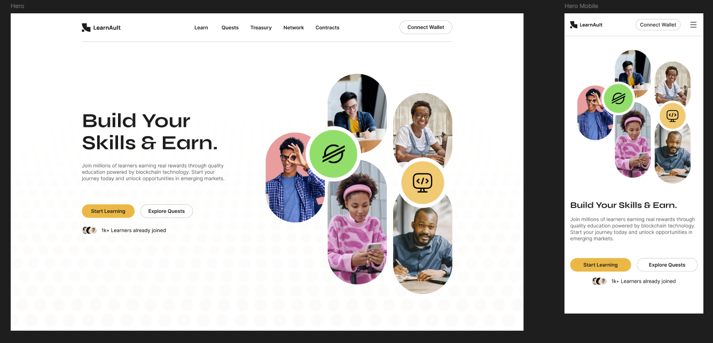

# Hero Section: Learn to Earn Landing Page

## 🎯 The Job Done
This PR delivers the high-fidelity design for the "LearnAult" landing page Hero section, fulfilling the requirement for a visually striking above-the-fold experience.

**Deliverables Completed:**
* **High-Fidelity Layouts:** Fully designed desktop and mobile (responsive) views in Figma.
* **Asset Handoff:** Background elements and the main hero collage have been grouped and exported. Ready to be dropped into `frontend/public/assets/images/hero-bg.png`.
* **Responsive Stacking:** The mobile layout is optimized to stack logically, keeping the value proposition and primary CTAs immediately accessible before users scroll to the imagery.

## 🧠 Design Rationale

**1. Visualizing "Learn to Earn"**
Instead of a generic abstract background or a complex dashboard UI, I opted for a dynamic collage of real, relatable learners. To instantly communicate the tech and Web3 nature of the platform, I integrated floating badges—specifically the Stellar network logo and a coding icon. This visually bridges the gap between human education and blockchain technology.

**2. Copy & CTA Strategy**
* **Primary CTA ("Start Learning"):** Treated with a solid, high-contrast brand yellow to ensure it is the most prominent interactive element on the screen, driving immediate user action.
* **Secondary CTA Pivot ("Explore Quests"):** The original brief requested "For Employers". However, given the Web3 and blockchain-powered nature of the platform, changing this to "Explore Quests" leans into the gamified "Learn to Earn" ecosystem. It feels much more native to the user journey.
* **Social Proof:** Added a small "1k+ Learners already joined" indicator with avatar thumbnails right below the CTAs to build immediate trust.

**3. Layout & Hierarchy**
The design uses a clean, asymmetrical split on desktop to balance the heavy typography on the left with the energetic imagery on the right. The ample whitespace ensures the "Build Your Skills & Earn" headline breathes and captures the user's full attention immediately.

## 🔗 Links & Resources
* **Figma File:** [figma](https://www.figma.com/design/LGsY81Bp8oUSwuc2IxIEEG/Learnault?node-id=0-1&t=vWoCZDXcNc5gApha-1)

## 🎯 The Job Done
This PR delivers the high-fidelity UI for the "Why Learnault" section, designed to sit directly below the Hero. It successfully translates the core value propositions of Web3 education for users in emerging markets into a digestible, scannable format.

**Deliverables Completed:**
* **High-Fidelity Layouts:** Responsive desktop (3x2 grid) and mobile (vertical stack) views designed in Figma.
* **Asset Handoff:** All custom line-art icons have been prepped and are ready to be uploaded as optimized `.SVG` / `.WEBP` files to ensure crisp rendering and fast load times.
* **Visual Continuity:** Maintained the clean, whitespace-heavy aesthetic from the Hero section, using the brand yellow for the iconography to create a cohesive scroll experience.

## 🧠 Design Rationale

**1. Empowering Messaging over Negative Comparisons**
While the issue requested a contrast between "broken traditional education" and our Web3 solution, I opted to frame this section entirely around empowerment: **"The Future of Learning"**. For prospective learners in emerging markets, focusing directly on the tangible, high-value solutions (earning real value, global access, borderless opportunities) is more highly converting than dwelling on the pain points they already experience daily.

**2. Scannable Solution Grid**
To make the dense Web3 concepts easily digestible, I utilized a clean grid layout. 
* **Bridging the Skills Gap:** Addressed via the "On-chain Credentials" and "Global Community" cards, proving the real-world utility of the platform.
* **Solving Currency/Inflation Hurdles:** Addressed via "Secure Wallets", "Quick Payouts", and "No Borders". I explicitly highlighted the **Stellar blockchain** in the copy to build immediate trust regarding low fees and fast, secure transactions.

**3. Minimalist Iconography**
I designed custom, lightweight yellow line icons. This prevents the section from feeling visually overwhelming after the heavy imagery in the Hero section, guiding the user's eye directly to the value proposition copy.

## 🔗 Links & Resources
* **Figma File:** [figma](https://www.figma.com/design/LGsY81Bp8oUSwuc2IxIEEG/Learnault?node-id=0-1&t=vWoCZDXcNc5gApha-1)

### ✅ Acceptance Criteria Checklist
- [x] High-fidelity desktop and mobile layouts provided.
- [x] Clear communication of Web3 solutions tailored for emerging markets.
- [x] Optimized `.SVG` or `.WEBP` assets are attached/exported.

## How It Works Section
🎯 The Job Done

This PR delivers the high-fidelity UI for the “How It Works” section, designed to clearly communicate Learnault’s core product loop in a simple, step-by-step format.

## Deliverables Completed:

High-Fidelity Layouts: Responsive desktop (horizontal flow) and mobile (stacked steps) designs in Figma.
Process Visualization: A 3-step structured flow illustrating the journey from learning to earning and verification.
Icon System: Minimal, consistent icons created to represent each step without visual clutter.

## 🧠 Design Rationale

1. Simplifying a Complex Web3 Flow
Web3 products often feel intimidating. This section reduces cognitive load by presenting the experience as a simple loop:

Learn → Earn → Verify

This makes the platform instantly understandable, even for non-crypto-native users.

2. Guided User Journey
Each step builds naturally on the previous one:

Learn: Users engage with structured content
Earn: Users are rewarded through quests
Verify: Achievements become on-chain credentials

This reinforces both progression and purpose.

3. Visual Continuity & Flow
A horizontal connector (line or subtle arrows) is used on desktop to guide the eye across steps, while mobile stacks maintain clarity and readability.

## 🔗 Links & Resources
Figma File: [figma](https://www.figma.com/design/LGsY81Bp8oUSwuc2IxIEEG/Learnault?node-id=0-1&t=8jAnWVoNYABdUrUb-1)

✅ Acceptance Criteria Checklist
 Clear 3-step product flow
 Easy-to-understand Web3 onboarding
 Responsive layout (desktop + mobile)

## Stellar Learning Path Section
🎯 The Job Done

This PR delivers the high-fidelity UI for the “Stellar Learning Path” section, introducing a structured, tier-based course system to replace generic learning categories.

## Deliverables Completed:

Tier-Based Course Design: 3 progressive tiers (Beginner → Advanced)
Content-Rich Cards: Each tier includes duration, level, content breakdown, and rewards
Progression System: Locked/unlocked states to guide user advancement
Responsive Layouts: Horizontal cards (desktop) and stacked progression (mobile)

## 🧠 Design Rationale

1. Turning Learning into Progression
Instead of allowing users to passively browse courses, this system introduces a clear progression path:

Complete → Unlock → Advance

This increases engagement and retention.

2. Familiar Structure, New Incentives
Each tier mimics traditional course platforms (duration, lessons, outcomes) while layering in Web3 incentives:

Token rewards
On-chain credentials
Unlockable quests

3. Motivation Through Unlocks
Tier gating creates a sense of achievement:

Tier 1 unlocks Tier 2
Tier 2 unlocks Tier 3

This encourages users to continue rather than drop off.

## 🔗 Links & Resources
Figma File: [figma](https://www.figma.com/design/LGsY81Bp8oUSwuc2IxIEEG/Learnault?node-id=0-1&t=8jAnWVoNYABdUrUb-1)

✅ Acceptance Criteria Checklist
 Structured tier-based course system
 Clear progression and unlock logic
 Integrated rewards and credentials
 Fully responsive UI

## Quests / Missions Section
🎯 The Job Done

This PR delivers the high-fidelity UI for the “Quests” section, showcasing the gamified earning layer of Learnault.

## Deliverables Completed:

Quest Cards UI: Designed task-based cards displaying rewards, difficulty, and objectives
Gamification Layer: Visual indicators for progress and rewards
Responsive Layouts: Grid (desktop) and stacked cards (mobile)

## 🧠 Design Rationale

1. Reinforcing “Earn While You Learn”
This section makes the earning mechanism tangible by showing real examples of tasks users can complete.

2. Gamification for Engagement
By presenting tasks as “quests,” the experience feels interactive and rewarding rather than instructional.

3. Clear Reward Visibility
Token rewards are visually highlighted to immediately communicate value.

## 🔗 Links & Resources
Figma File: [figma](https://www.figma.com/design/LGsY81Bp8oUSwuc2IxIEEG/Learnault?node-id=0-1&t=8jAnWVoNYABdUrUb-1)

✅ Acceptance Criteria Checklist
 Clear quest/task representation
 Reward-focused UI
 Gamified learning experience

## Testimonials Section
🎯 The Job Done

This PR delivers the high-fidelity UI for the “Success Stories” section, providing social proof through real user experiences.

## Deliverables Completed:

Testimonial Cards: User quotes with avatars and names
Responsive Layouts: Carousel/grid (desktop) and stacked (mobile)
Visual Consistency: Maintained clean aesthetic with subtle emphasis on user content

## 🧠 Design Rationale

1. Building Trust Early
For new users, especially in emerging markets, trust is critical. Testimonials provide immediate validation.

2. Relatable Success Stories
Content focuses on real outcomes:

Earning rewards
Gaining skills
Accessing opportunities

## 🔗 Links & Resources
Figma File: [figma](https://www.figma.com/design/LGsY81Bp8oUSwuc2IxIEEG/Learnault?node-id=0-1&t=8jAnWVoNYABdUrUb-1)

✅ Acceptance Criteria Checklist
 Clear social proof
 Human-centered storytelling
 Responsive layout

## FAQ Section
🎯 The Job Done

This PR delivers the high-fidelity UI for the FAQ section, addressing common user concerns and reducing friction.

## Deliverables Completed:

Accordion Component: Expandable/collapsible questions
Content Structure: Clear, concise answers tailored to new users
Responsive Layout: Optimized for readability across devices

## 🧠 Design Rationale

1. Reducing Entry Barriers
Web3 platforms often raise questions. This section proactively answers them.

2. Clean Information Architecture
Accordion design prevents overload while keeping content accessible.

## 🔗 Links & Resources
Figma File: [figma](https://www.figma.com/design/LGsY81Bp8oUSwuc2IxIEEG/Learnault?node-id=0-1&t=8jAnWVoNYABdUrUb-1)

✅ Acceptance Criteria Checklist
 Clear, concise answers
 Accessible accordion UI
 Reduced onboarding friction

## Final CTA Section
🎯 The Job Done

This PR delivers the high-impact final call-to-action section, designed to convert users after they’ve explored the page.

## Deliverables Completed:

Bold CTA Layout: Clear headline + action buttons
Visual Emphasis: Strong contrast and spacing
Responsive Design: Maintains prominence across devices

## 🧠 Design Rationale

1. Conversion Focus
After building trust and understanding, this section pushes users to take action.

2. Clear Next Step
Simple messaging ensures no confusion about what to do next:

Start Learning → Start Earning

## 🔗 Links & Resources
Figma File: [figma](https://www.figma.com/design/LGsY81Bp8oUSwuc2IxIEEG/Learnault?node-id=0-1&t=8jAnWVoNYABdUrUb-1)

✅ Acceptance Criteria Checklist
 Strong conversion-focused CTA
 Clear messaging
 Responsive layout

## Footer Section
🎯 The Job Done

This PR delivers the structured footer for Learnault, providing navigation, resources, and platform credibility.

## Deliverables Completed:

Multi-Column Layout: Organized navigation and resource links
Resource Access: Documentation, API, and community links
Responsive Design: Clean stacking for mobile

## 🧠 Design Rationale

1. Navigation & Accessibility
Provides users with quick access to important areas of the platform.

2. Trust & Transparency
Including documentation and contact points reinforces legitimacy.

## 🔗 Links & Resources
Figma File: [figma](https://www.figma.com/design/LGsY81Bp8oUSwuc2IxIEEG/Learnault?node-id=0-1&t=8jAnWVoNYABdUrUb-1)

✅ Acceptance Criteria Checklist
 Clear navigation structure
 Accessible resources
 Responsive layout